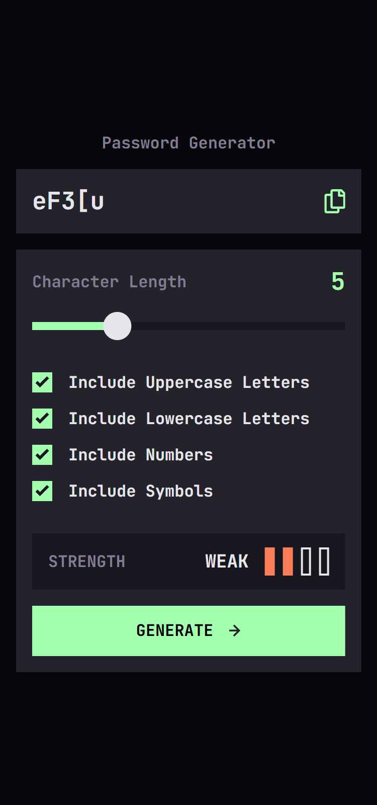
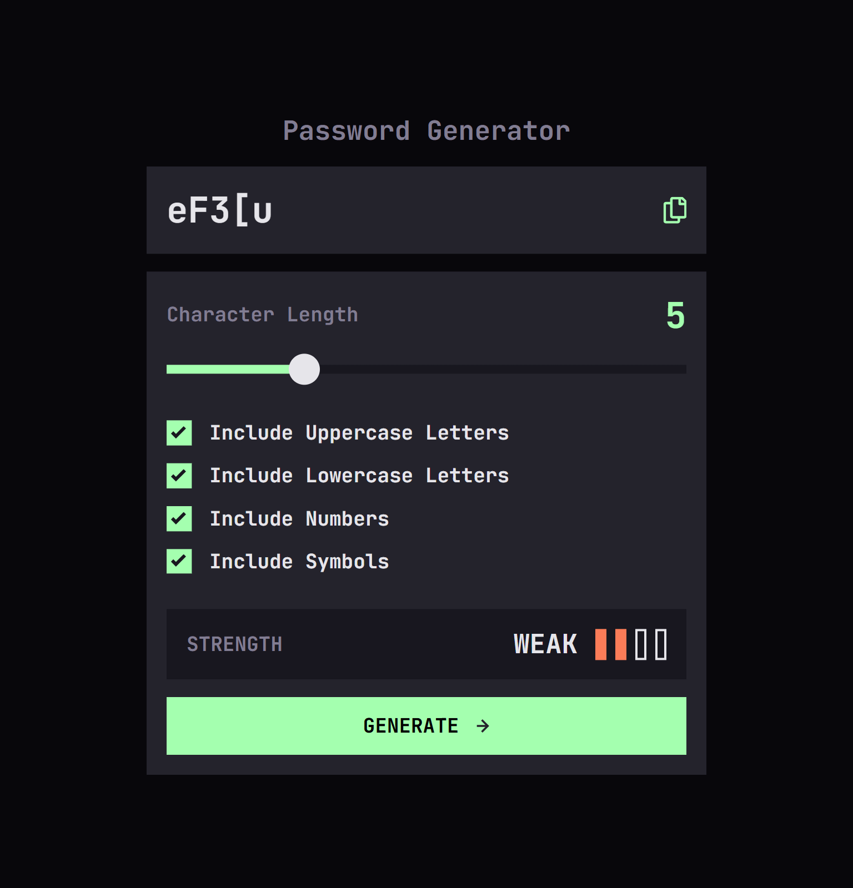
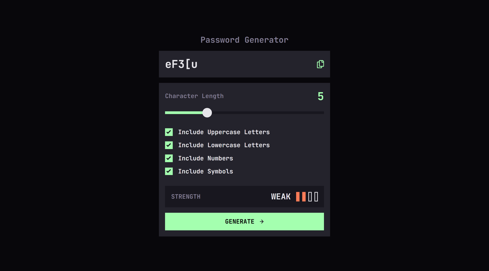

# Frontend Mentor - Password generator app solution

This is a solution to the [Password generator app challenge on Frontend Mentor](https://www.frontendmentor.io/challenges/password-generator-app-Mr8CLycqjh). Frontend Mentor challenges help you improve your coding skills by building realistic projects.

## Table of contents

- [Overview](#overview)
  - [The challenge](#the-challenge)
  - [Screenshot](#screenshot)
  - [Links](#links)
- [My process](#my-process)
  - [Built with](#built-with)
  - [What I learned](#what-i-learned)
- [Author](#author)

**Note: Delete this note and update the table of contents based on what sections you keep.**

## Overview

### The challenge

Users should be able to:

- Generate a password based on the selected inclusion options
- Copy the generated password to the computer's clipboard
- See a strength rating for their generated password
- View the optimal layout for the interface depending on their device's screen size
- See hover and focus states for all interactive elements on the page

### Screenshot





### Links

- Solution URL: https://github.com/TumeloLutaka/password-generator-app
- Live Site URL: https://tumelolutaka.github.io/password-generator-app

## My process

### Built with

- Semantic HTML5 markup
- CSS custom properties
- Flexbox
- CSS Grid
- Mobile-first workflow
- Javascript
- CSS Media Quries

**Note: These are just examples. Delete this note and replace the list above with your own choices**

### What I learned

This challenged help improve my foundational javascript knowledge helping me use it to implement patterns in new ways that are efficient and try to emphasize the DRY methodology. My most appreciated part of this challenge, and the frontend mentor courses in general, is helping me improve my implementation of CSS variables to have an easier time of managing it responsively as shown below with the implementation of font style tokens.

```css
/* Typography */
--typo-preset-1: var(--fw-bold) var(--ptr-32)/1.31 "JetBrains Mono", monospace;
--typo-preset-2: var(--fw-bold) var(--ptr-24)/1.33 "JetBrains Mono", monospace;
--typo-preset-3: var(--fw-bold) var(--ptr-18)/1.33 "JetBrains Mono", monospace;
--typo-preset-4: var(--fw-bold) var(--ptr-16)/1.25 "JetBrains Mono", monospace;

--font-style-body: var(--typo-preset-4);
--font-style-password: var(--typo-preset-2);
--font-style-title: var(--typo-preset-4);
--font-style-strength-text: var(--typo-preset-3);
```

## Author

- Frontend Mentor - [@TumeloLutaka](https://www.frontendmentor.io/profile/TumeloLutaka)
- Github - [@TumeloLutaka](https://github.com/TumeloLutaka)
